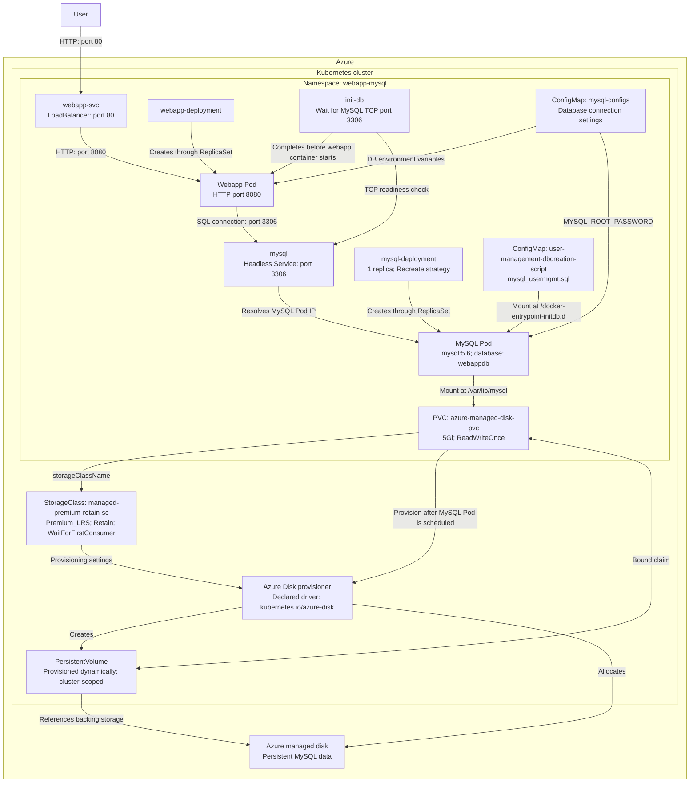
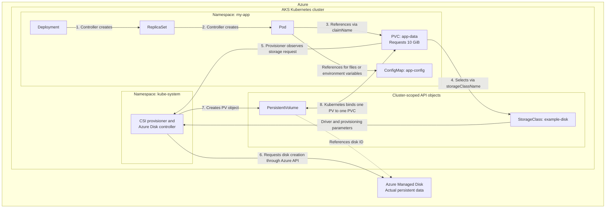

# Webapp and MySQL sandbox

This sandbox uses nested Kustomizations without bases or overlays. The root includes
`namespace.yaml`, `mysql/`, and `webapp/`; each child can also be rendered or applied
independently. Both children target the `webapp-mysql` namespace. Applying the root
creates this namespace; applying a child alone requires the namespace to exist first.

The MySQL manifests live in `mysql/`. The webapp Deployment and Service live in
`webapp/` and are included in its Kustomization. The root renders the namespace
and both workloads.

See the [sandbox procedure](../../../../docs/onboarding-an-application.md#sandbox-webapp-and-mysql)
for prerequisites, rendering, and apply commands.

## Specs

- Storage Class
- Persistent Volumes
- Persistent Volume Claims (PVC)
- ConfigMap
- Volumes
- Volume Mount

- Init Containers

## End-to-end setup

The diagram shows the intended request path and the MySQL initialization and
persistent storage setup. Both workloads are included in the root Kustomization.
Kubernetes controllers and the
Azure storage provisioner create the Pods, PersistentVolume, and backing disk;
these are not separate manifests in this sandbox.



The SQL initialization script runs when MySQL initializes an empty data directory;
it does not run on every Pod restart with an existing database. The PVC preserves
database files across Pod replacement. The StorageClass's `Retain` policy retains
the PersistentVolume and backing storage after the claim is deleted; reclaiming
that storage requires manual administration.

The diagram shows the catalog default `Premium_LRS`. The UK South sandbox cluster
overlay overrides the disk type to `StandardSSD_LRS` for `Standard_D2_v5` nodes.
It keeps the legacy StorageClass name to preserve PVC references. See the
[existing disk recovery procedure](../../../../docs/onboarding-an-application.md#recover-an-existing-premium-disk-on-uk-south-sandbox)
for disk conversion and the one-time StorageClass replacement.

### Service name and database hostname

The Service's `metadata.name` defines its Kubernetes DNS hostname. The MySQL
Service is named `mysql`, so the `mysql-configs` ConfigMap sets
`db_hostname: "mysql"` and the webapp init container checks `mysql:3306`. The short
hostname works because both workloads are in the `webapp-mysql` namespace.
Because this Service is headless, its DNS records resolve to the selected MySQL
Pod IP addresses.

The Deployment name and the `app: mysql` selector label do not define this DNS
hostname. The selector tells the Service which Pods to expose. If you rename the
Service, update the ConfigMap hostname and init container's readiness check to
match; creating a Service with a different name does not create an alias for
`mysql`.

### Credentials

Database credentials currently come from a ConfigMap; move passwords to a Secret
before using this outside the sandbox.

## Kustomize

Kustomize provides the convenience of not having to repeatedbly add "namespace: <>" in all manifest. **Creating Namespace alone does not assign resources to it.**

This setting in child `kustomization.yaml` does:

```
namespace: webapp-mysql
```

Kustomize adds `metadata.namespace: webapp-mysql` to rendered Deployment, Service, PVC, and ConfigMap. No need to repeat it in each manifest. Deployment’s Pods inherit its namespace.

Cluster-scoped resources, such as StorageClass, stay outside namespaces.

Use `kubectl apply -k` to apply these transformations. `kubectl apply -f deployment.yaml` bypasses Kustomize.

## Definitions

### Storage

Ways to provide both long-term and temporary storage to Pods in your cluster. Kubernetes volumes provide a way for containers in a Pod to access and share data via the filesystem.

Managing storage is a distinct problem from managing compute instances. The PersistentVolume subsystem provides an API for users and administrators that abstracts details of how storage is provided from how it is consumed. To do this, we introduce two new API resources: PersistentVolume and PersistentVolumeClaim.

### Storage Class

A StorageClass provides a way for administrators to describe the classes of storage they offer. Different classes might map to quality-of-service levels, or to backup policies, or to arbitrary policies determined by the cluster administrators. Kubernetes itself is unopinionated about what classes represent.

WaitForConsumer is a recommended approach so that a new volume is only created at the location and point where the deployment/workload requests for it. Otherwise, volume could have been created already and cause latency issue if the workload is in a different region

### Persistent Volume

A PersistentVolume (PV) is a piece of storage in the cluster that has been provisioned by an administrator or dynamically provisioned using Storage Classes. It is a resource in the cluster just like a node is a cluster resource. PVs are volume plugins like Volumes, but have a lifecycle independent of any individual Pod that uses the PV. This API object captures the details of the implementation of the storage, be that NFS, iSCSI, or a cloud-provider-specific storage system.

### Persistent Volume Claim

A PersistentVolumeClaim (PVC) is a request for storage by a user. It is similar to a Pod. Pods consume node resources and PVCs consume PV resources. Pods can request specific levels of resources (CPU and Memory). Claims can request specific size and access modes (e.g., they can be mounted ReadWriteOnce, ReadOnlyMany, ReadWriteMany, or ReadWriteOncePod, see AccessModes).

---

The Deployment defines Pods; each Pod references a PVC for persistent data and can reference a ConfigMap for configuration. The PVC gets its storage through a PV, often provisioned using a StorageClass.

Object What it does Scope

Deployment Defines the application’s Pod template, replicas and rollout behaviour. Namespace

PersistentVolumeClaim (PVC) Requests storage: “I need 10 GiB with this storage class and access mode.” Namespace

StorageClass Defines how to provision storage: driver, disk type and provisioning settings. Cluster

PersistentVolume (PV) Represents an allocated storage volume and references its actual storage backend. Cluster

ConfigMap Holds non-secret configuration, supplied to containers as files or environment variables. Namespace


