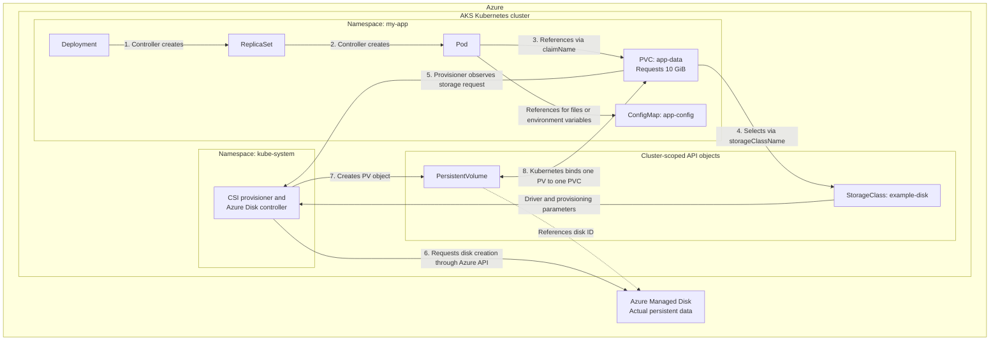

# Webapp and MySQL sandbox

This sandbox uses nested Kustomizations without bases or overlays. The root includes
both `mysql/` and `webapp/`; each child can also be rendered or applied independently.
Both children target the `webapp-mysql` namespace.

The MySQL manifests live in `mysql/`. The `webapp/` Kustomization is currently empty;
add the webapp manifests there and list them in its `resources` before deploying it.
Applying the root currently deploys only MySQL.

See the [sandbox procedure](../../../../docs/onboarding-an-application.md#sandbox-webapp-and-mysql)
for prerequisites, rendering, and apply commands.

## Specs

- Storage Class
- Persistent Volumes
- Persistent Volume Claims (PVC)
- ConfigMap
- Volumes
- Volume Mount

- Init Containers

## Setup

User - > Load Balancer (Service) -> Web App (deployment) -> MySQL Ip (Cluster IP Service) -> MySQL (Deployment)

## Definitions

### Storage

Ways to provide both long-term and temporary storage to Pods in your cluster. Kubernetes volumes provide a way for containers in a Pod to access and share data via the filesystem.

Managing storage is a distinct problem from managing compute instances. The PersistentVolume subsystem provides an API for users and administrators that abstracts details of how storage is provided from how it is consumed. To do this, we introduce two new API resources: PersistentVolume and PersistentVolumeClaim.

### Storage Class

A StorageClass provides a way for administrators to describe the classes of storage they offer. Different classes might map to quality-of-service levels, or to backup policies, or to arbitrary policies determined by the cluster administrators. Kubernetes itself is unopinionated about what classes represent.

WaitForConsumer is a recommended approach so that a new volume is only created at the location and point where the deployment/workload requests for it. Otherwise, volume could have been created already and cause latency issue if the workload is in a different region

### Persistent Volume

A PersistentVolume (PV) is a piece of storage in the cluster that has been provisioned by an administrator or dynamically provisioned using Storage Classes. It is a resource in the cluster just like a node is a cluster resource. PVs are volume plugins like Volumes, but have a lifecycle independent of any individual Pod that uses the PV. This API object captures the details of the implementation of the storage, be that NFS, iSCSI, or a cloud-provider-specific storage system.

### Persistent Volume Claim

A PersistentVolumeClaim (PVC) is a request for storage by a user. It is similar to a Pod. Pods consume node resources and PVCs consume PV resources. Pods can request specific levels of resources (CPU and Memory). Claims can request specific size and access modes (e.g., they can be mounted ReadWriteOnce, ReadOnlyMany, ReadWriteMany, or ReadWriteOncePod, see AccessModes).

---

The Deployment defines Pods; each Pod references a PVC for persistent data and can reference a ConfigMap for configuration. The PVC gets its storage through a PV, often provisioned using a StorageClass.

Object What it does Scope

Deployment Defines the application’s Pod template, replicas and rollout behaviour. Namespace

PersistentVolumeClaim (PVC) Requests storage: “I need 10 GiB with this storage class and access mode.” Namespace

StorageClass Defines how to provision storage: driver, disk type and provisioning settings. Cluster

PersistentVolume (PV) Represents an allocated storage volume and references its actual storage backend. Cluster

ConfigMap Holds non-secret configuration, supplied to containers as files or environment variables. Namespace

