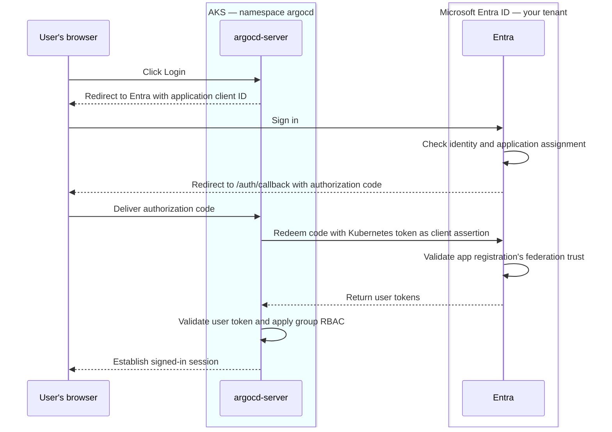

# Templates Manifest

## SSO Flow

```mermaid
sequenceDiagram
    participant B as User's browser
    box Azure AKS — namespace argocd
        participant A as argocd-server
    end
    box Microsoft Entra ID — your tenant
        participant E as Entra
    end

    B->>A: Click Login
    A-->>B: Redirect to Entra with application client ID
    B->>E: Sign in
    E->>E: Check identity and application assignment
    E-->>B: Redirect to /auth/callback with authorization code
    B->>A: Deliver authorization code
    A->>E: Redeem code with Kubernetes token as client assertion
    E->>E: Validate app registration's federation trust
    E-->>A: Return user tokens
    A->>A: Validate user token and apply group RBAC
    A-->>B: Establish signed-in session

```
